# Part 1: Building the Mini-ITX Mask

This tutorial should provide you with the necessary information on how to make an Mini-ITX compatible mounting for your CubieTruck which enables you to use (mostly) any standard PC casing.

---

## Materials

* *Mini-ITX mask*: Printed and cut-out 
* *Sheet metal*: Circa 18 × 18 cm (e.g. part of an old PC casing)
* 4 × *spacer screws* and appropriate *nuts* (for fastening the CubieTruck onto the Mini-ITX mounting,
shown [here](https://commons.wikimedia.org/wiki/File:Toennchen_IMGP5029_wp.jpg) in the middle)
* *Adhesive tape*
* Spare piece of *wooden board* (>=1 cm thick)

## Tools

* [Scriber](https://en.wikipedia.org/wiki/Scriber) and/or [center punch](https://en.wikipedia.org/wiki/Punch_%28tool%29#Centre) (alternatively you can make do with a knife and nail)
* Solid *metal ruler*
* *Hacksaw* or *plate shears*
* *Hammer*
* *Vise* or flat/combination *pliers*
* *Drilling machine* with 3,5 mm metal drill bit
* *Wrenches* (for the spacer screws and nuts)

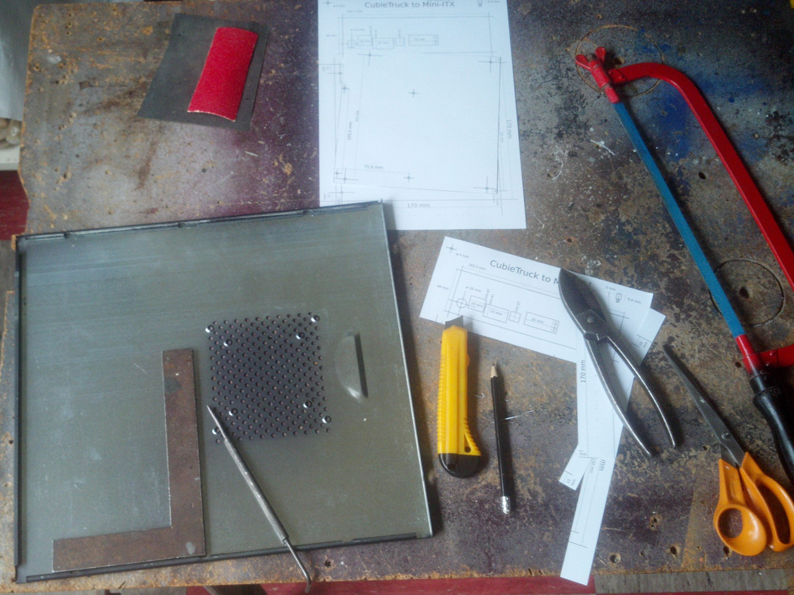

---

**Step A1:** Use the *metal ruler* and *scriber* (alternative: *knife*) to copy the outlines of the mask onto the *sheet metal*.

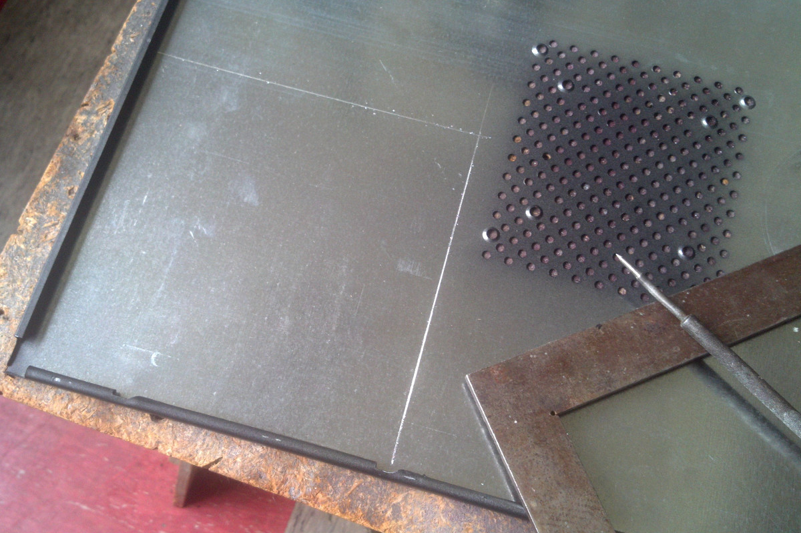

**Step A2:** cut another line alongside the first with a margin of approximately 5 mm towards the outside.

Note: If you make this margin too broad you will encounter problems later when installing the mounting into the casing. So choose rather 4 mm than 6.

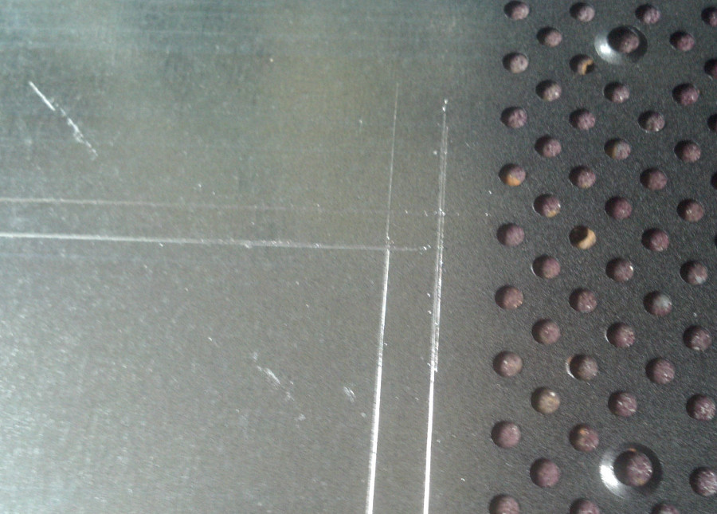

**Step A3:** Cut along the second, outer line with the *plate shears* or *hacksaw*.

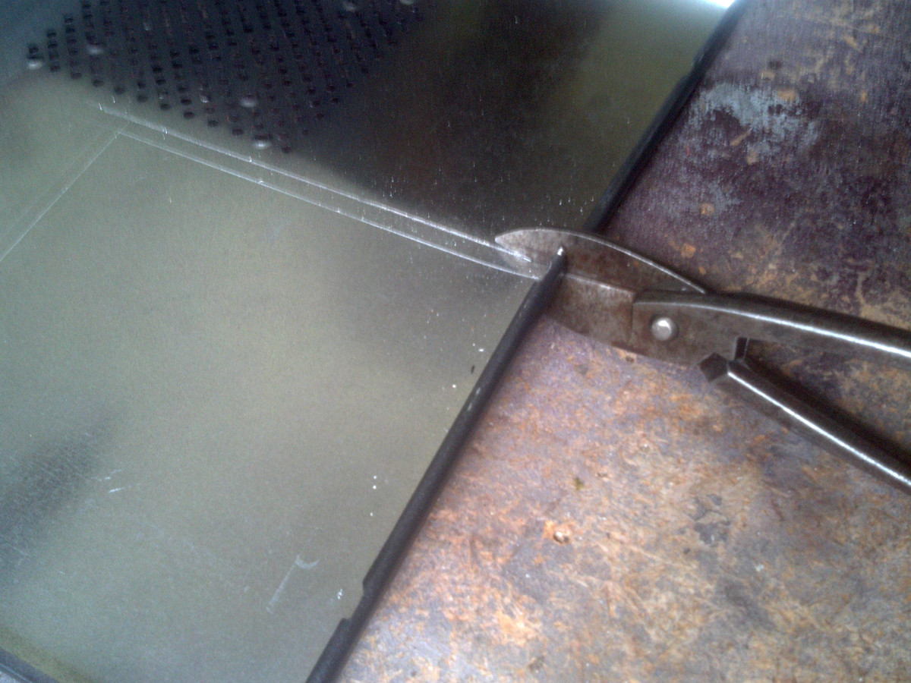

This is how the cut *sheet metal* could look like.

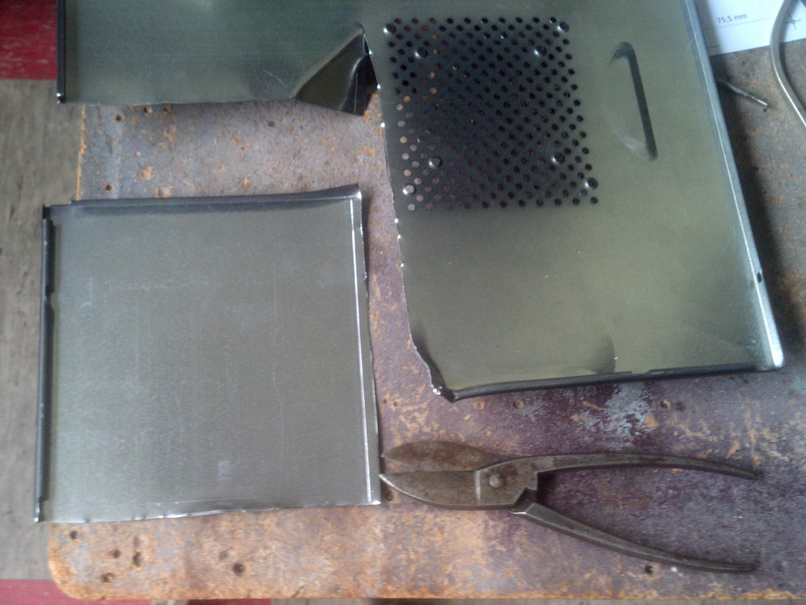

An den Ecken sollten jetzt Quadrate aus den eben eingeritzten Linien zu sehen sein. Diese trennen wir ab.

At the corners you should see squares between the lines we drew in steps 1 and 2. Cut those away.

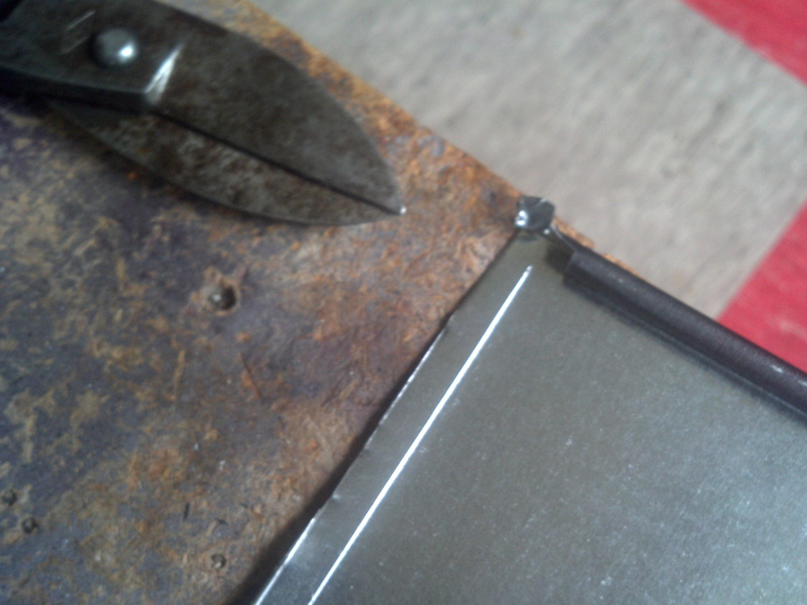

Now we are able to bend the edges along the inner lines by 90°. You can use the *pliers* or *vise* and *hammer* to do so.

Note: If using the *vise* you probably want to use a *scrap of cloth* to cushion the metal and prevent it from being scratched too badly.

Use the *vise* to get the edges straight or keep working with the *pliers* until you are satisfied with your handiwork.

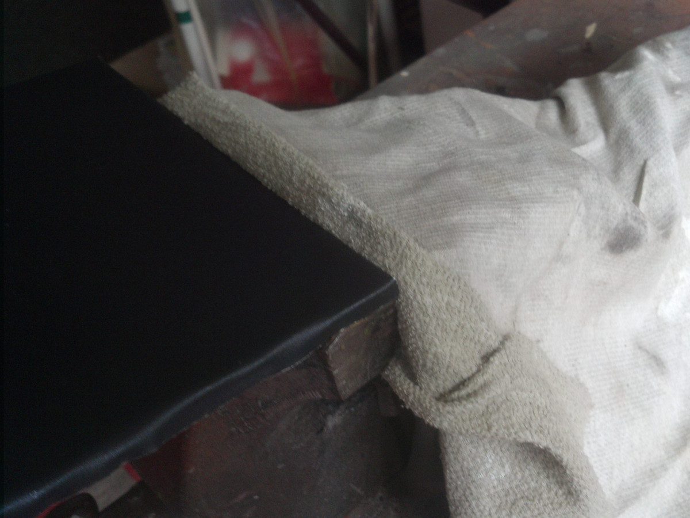

Now the metal should be stabilized and keep it's shape.

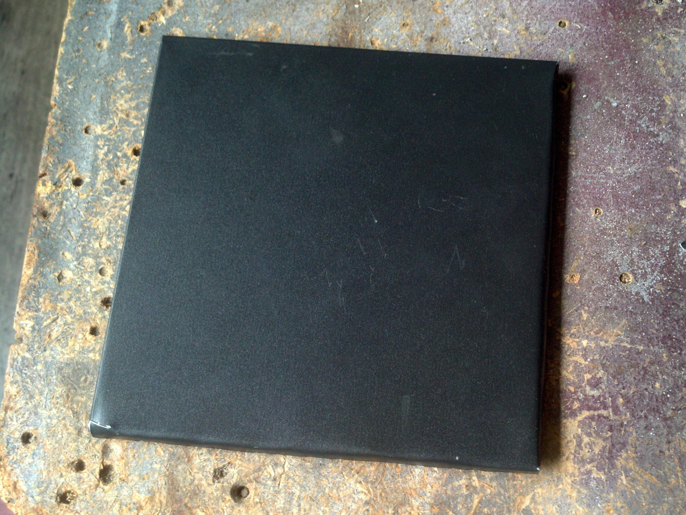

It could look like this.

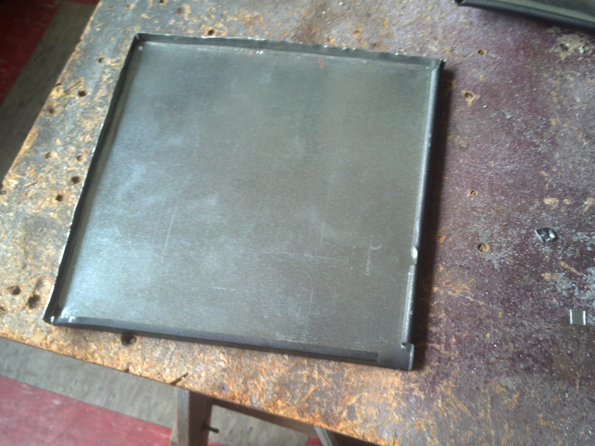

---

**Step B1:** Use the *adhesive tape* to fasten the paper template onto the metal.
Put your workpiece onto the piece of *wooden board* below the screw holes.
Now, one by one mark the screw holes using your *center punch* or *nail* and *hammer*, rearranging the position of the *wooden board* each time to adapt it to the position of the screw hole.

Note: Try and be as precise as possible to prevent problems later. Better double-check the position of the paper template, too.

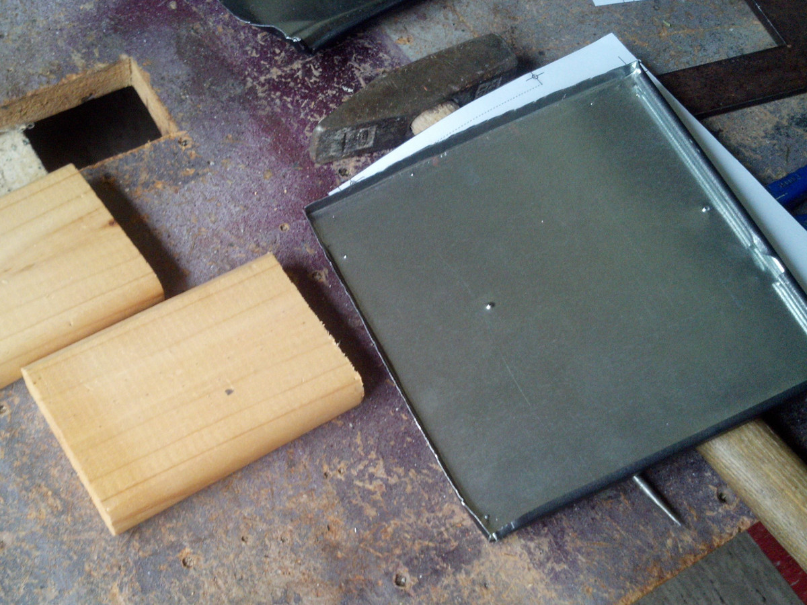

**Step B2:** Use your *drilling machine* to drill out each of the screw holes you marked in step B1.

**Step B3:** Now the *spacer screws* should go into the holes easily and you can fasten them with the *nuts*.

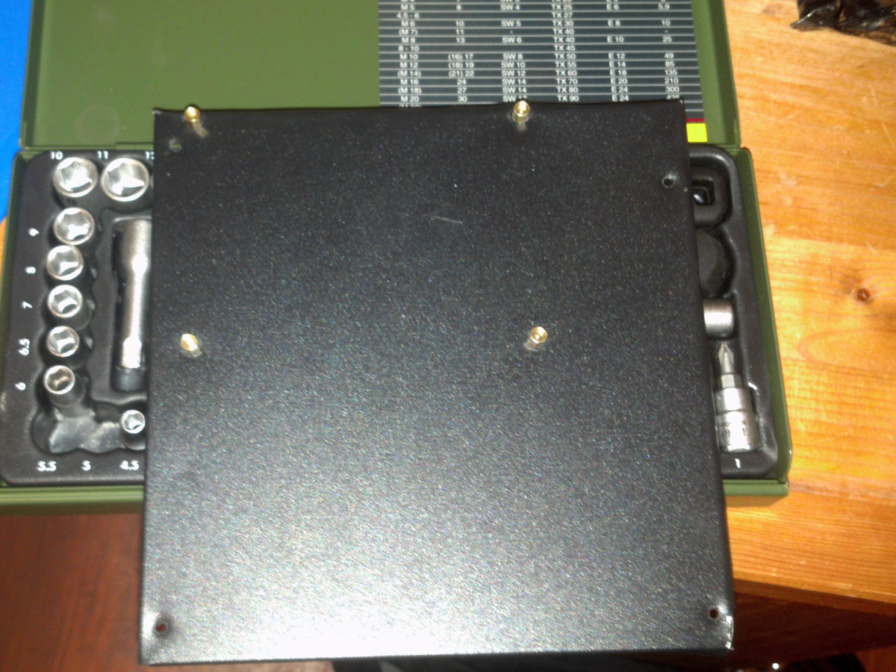

Make sure that all the *spacer screws* are perpendicular (angle of 90°) and that the *sheet metal* is as flat and even as possible.

**Step B4:** You should now be able to fasten the CubieTruck onto your mounting...

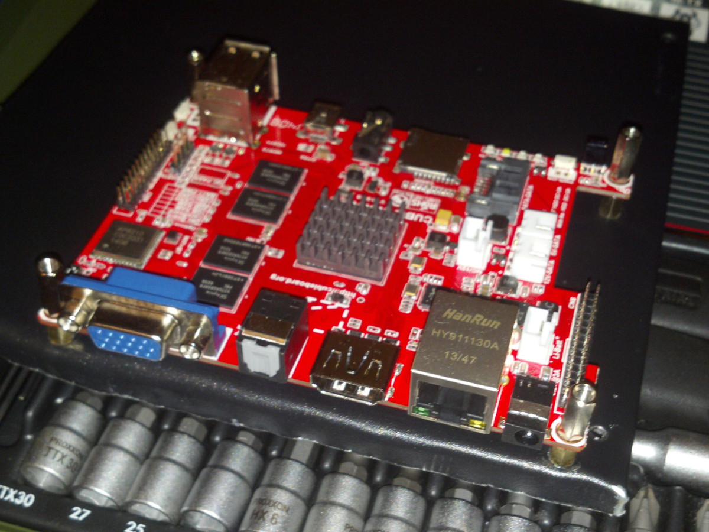

... and the mounting into your casing.

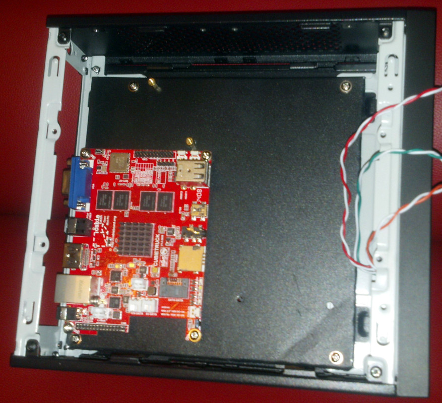

---

In [Part 2](Story_Pt2_IO_Shield.md) you can learn how to make the I/O shield for the back of the casing.
