# Part 2: Building the CubieTruck Input/Output Shield

The following article continues the tutorial [Part 1](Story_Pt1_Mini-ITX_Mask.md) on building the CubieTruck Mini-ITX mask.

It shows how you could build the input/output shield for the back of the PC casing.

Note: This tutorial and the dedicated pattern is designed for the PC case [Chieftec IX-01B](http://www.chieftec.eu/de/gehaeuse/itx-tower/ix-01b.html).
If you want to use another casing, you need to adapt the fasteners in the pattern accordingly.
If you do so, please consider contributing it as a SVG layer to this project.

---

## Materials

* *Mini-ITX mask*: Printed and cut-out 
* *Sheet metal*: Circa 200 × 50 mm (e.g. part of an old PC casing)
* 4 × *screws and nuts* (optimal: 2 mm diameter)
* *Adhesive tape*
* Spare piece of *wooden board* (>=1 cm thick)

## Tools

* *Hacksaw*
* *Plate shears* or *side cutter*
* [Scriber](https://en.wikipedia.org/wiki/Scriber) and/or [center punch](https://en.wikipedia.org/wiki/Punch_%28tool%29#Centre) (alternatively you can make do with a knife and nail)
* Solid *metal ruler*
* *Drilling machine*
    * *Drill bits*: 2, 3, 8 10 mm
* Small *file* for metal processing
* *Flat screwdriver*
* *Vise* (optional)

---

**Step 1:** Use the *metal ruler* and *scriber* (alternative: *knife*) to copy the outlines of the mask onto the *sheet metal*.
You might also want to copy the inner squares onto the metal.

Consider bending an edge along the upper line by 90° to improve the stability of the sheet metal tremendously.

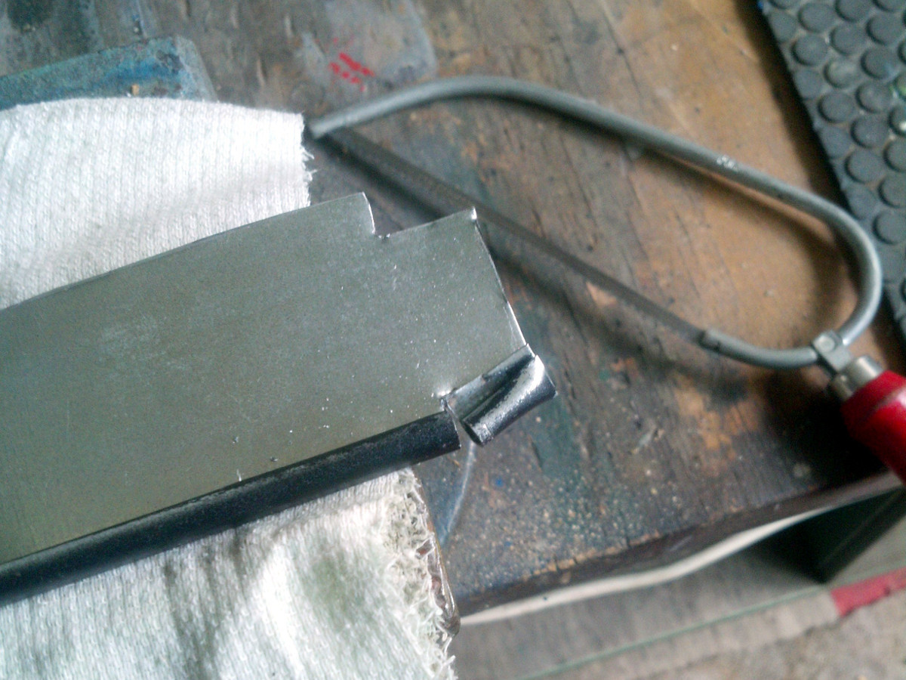

**Step 2:** Use the *adhesive tape* to fasten the paper template onto the metal.
Put your workpiece onto the piece of *wooden board* below the screw holes.
Now, one by one mark the screw holes using your *center punch* or *nail* and *hammer*, rearranging the position of the *wooden board* if necessary adapt it to the position of the screw hole.

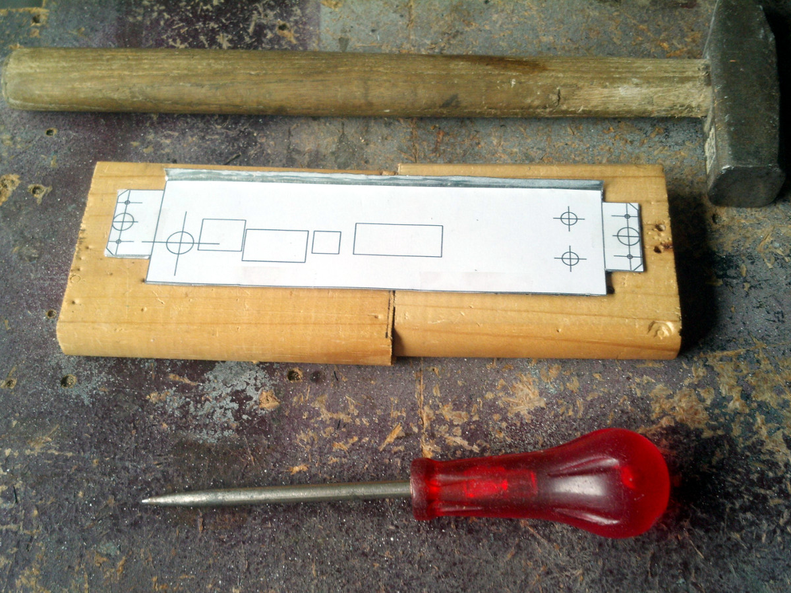

That also applies to the holes for the connectors inside the shield.
Punch plenty holes inside the square parts.

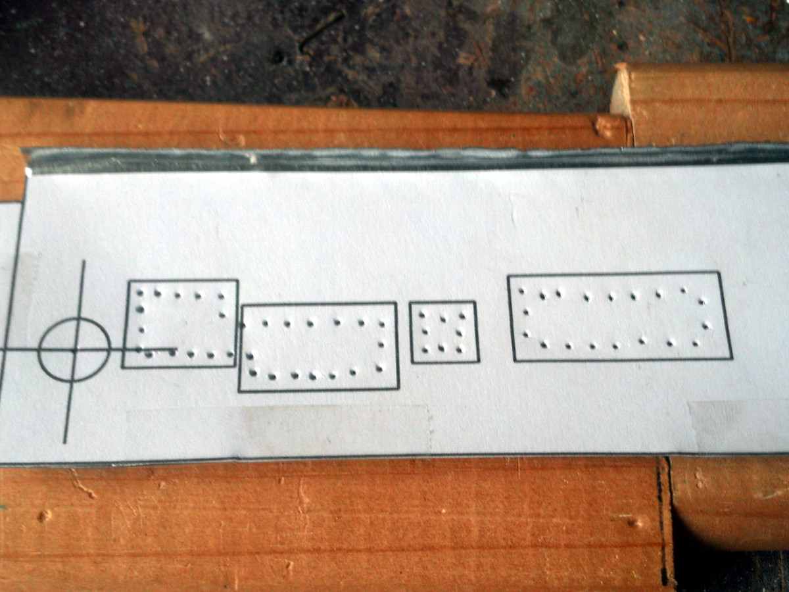

Note: I added some extra holes to the template to equip the I/O shield with audio and USB connectors.
You might or might not want to add those depending on your setup.

**Step 3:** Use your *drilling machine* to drill out each dents you marked in step 2.

Note: It might be advisable to always begin using the smallest drill bit and increase iteratively until the desired diameter is reached to create accurate holes.

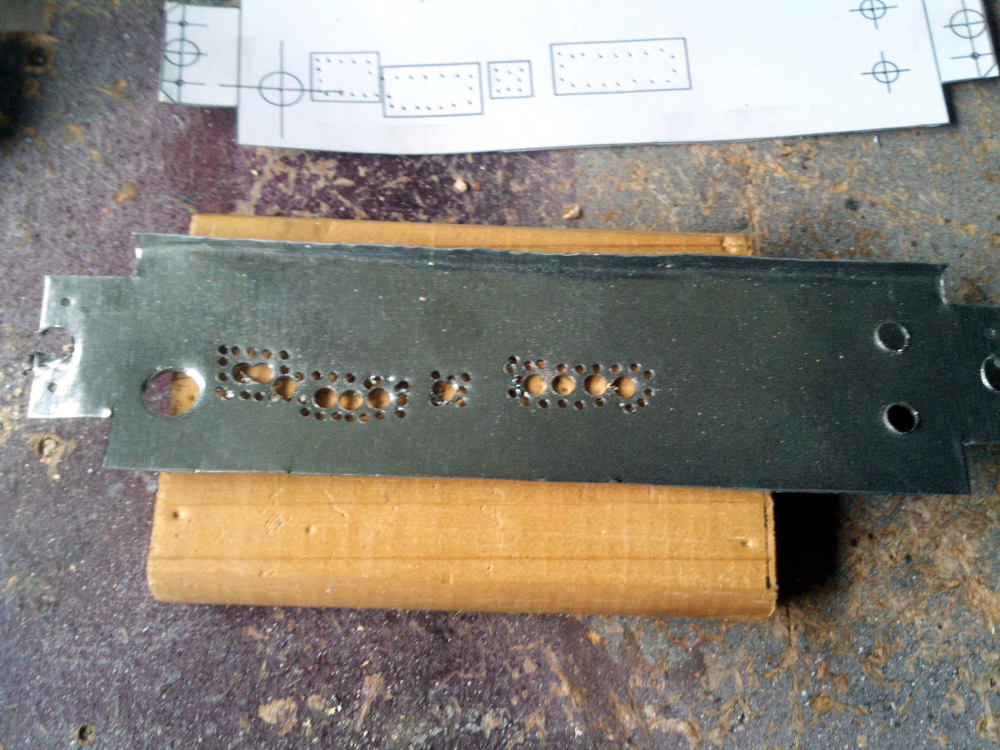

**Step 4:** Now use the *plate shears* or *side cutter* to remove the swiss-cheesy metal parts inside the square openings. The *flat screwdriver* can help you bending the shreds outside to be able to cut them.

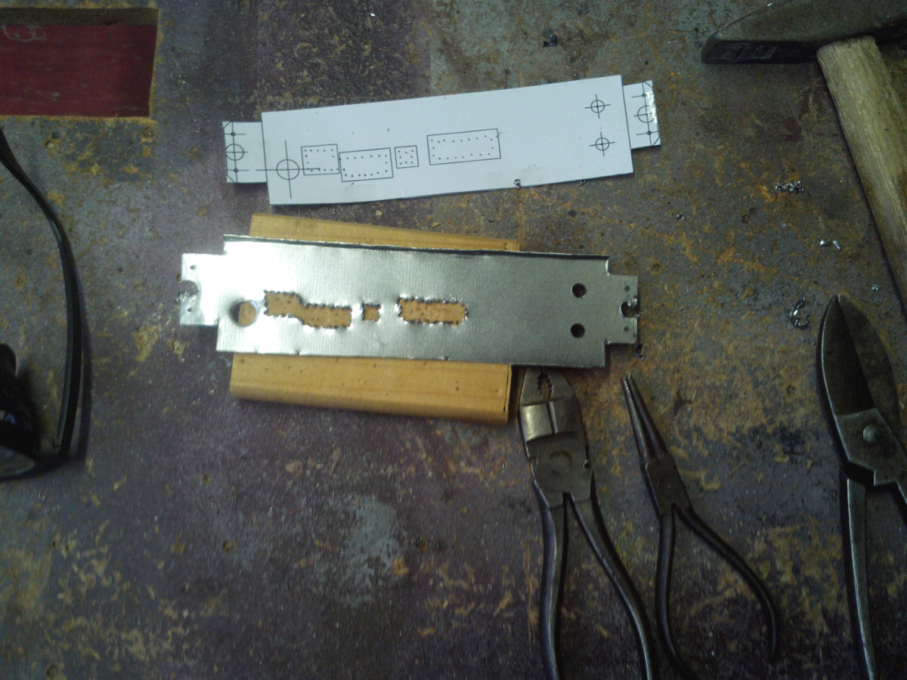

**Step 5:** If you haven't done so before, you might want to copy the inner squares onto the metal now by using the *scriber* or *knife* and the *metal ruler*.

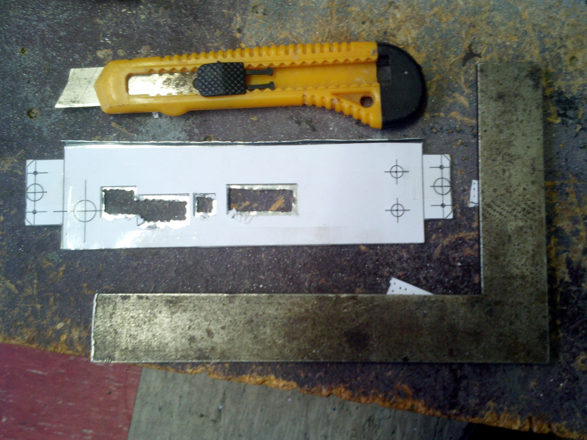

Work the openings using the *file* until the desired result is achieved.
The *vise* can help you steadying the workpiece while filing.

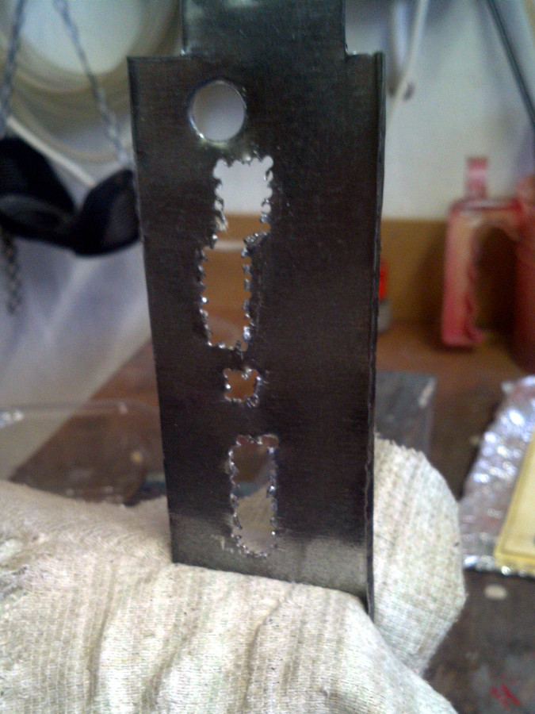

Repeatedly compare the openings to the template until the result is satisfactory.

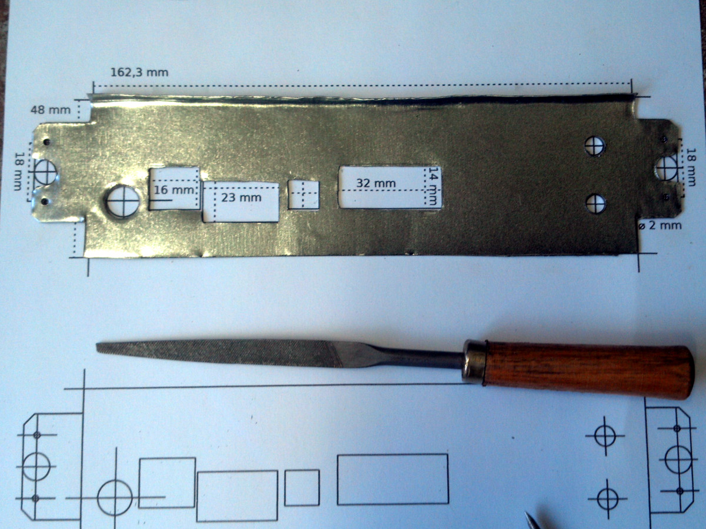

This is how the result could look like, depending on your personal expectations.

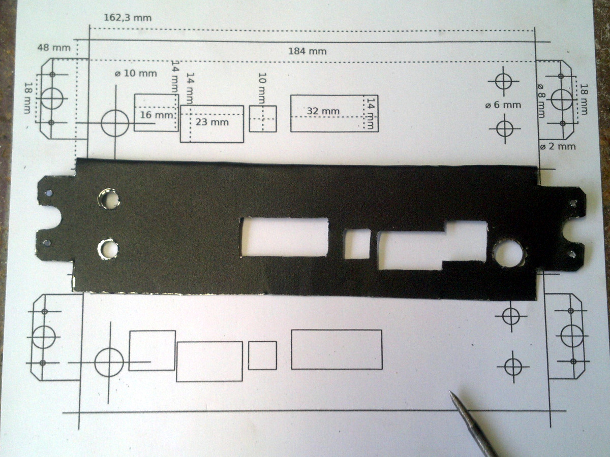

**Step 6:** The workpiece can now be fastened to the PC casing using fine 2 mm *screws and nuts*.

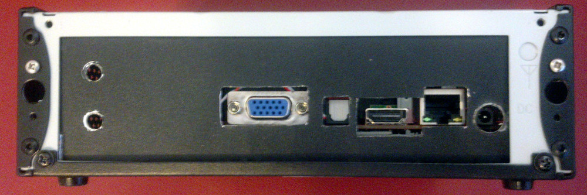

---

**Step 7 (optional):** You can add additional connectors to your workpiece.
In this example I added 2 × cinch and 1 × headphone for the USB DAC, USB socket, and an DC socket for the RAID module I took from the [LINDY Mobile RAID](http://www.lindy.co.uk/components-tools-c7/external-drive-enclosures-c320/usb-3-0-dual-sata-6g-mobile-raid-system-for-2-x-2-5-sata-hdd-p8575) to add another HDD.

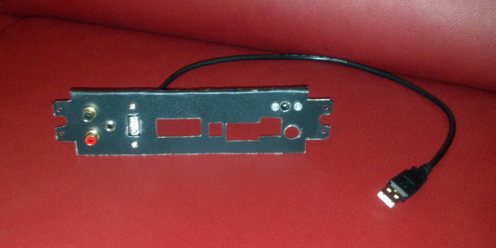

---

This is how the finished project could look like.

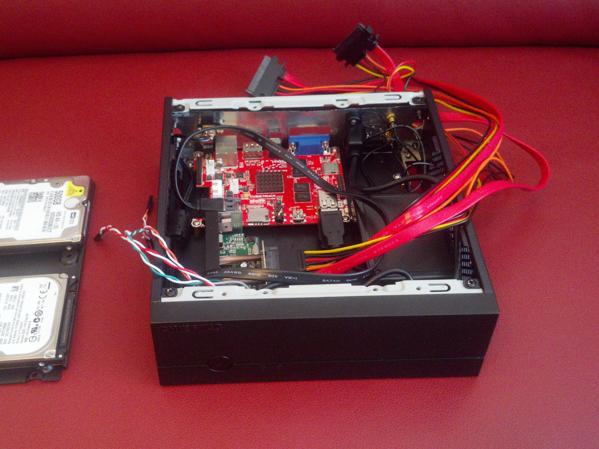

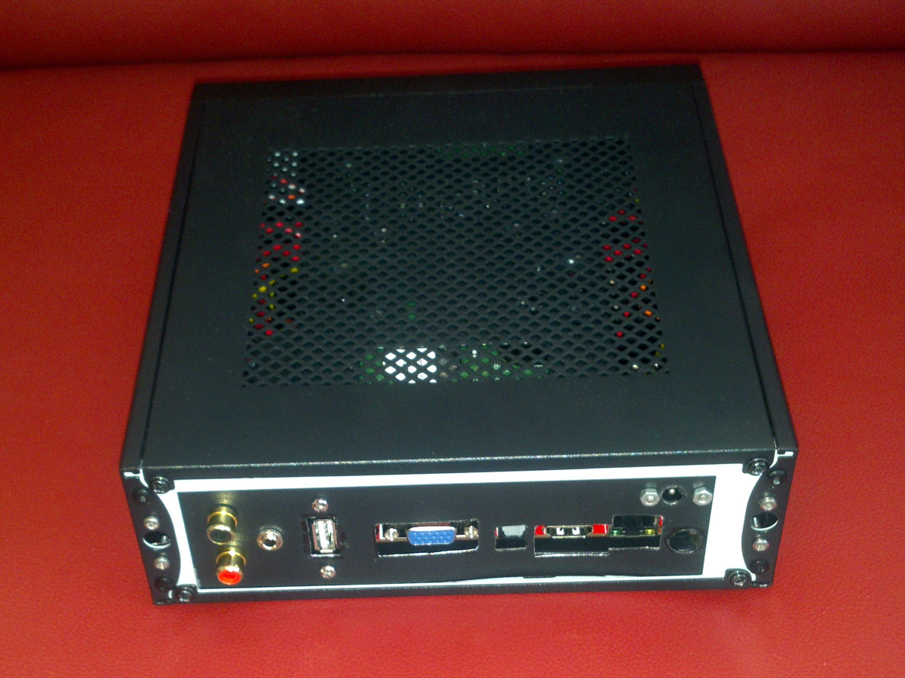

I placed it upon my stereo amp and use it as jukebox with MPD, as an NAS and much more.

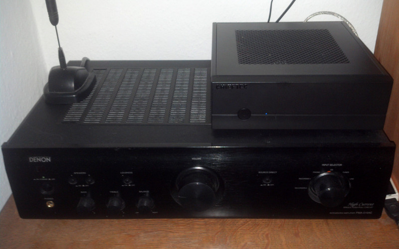
